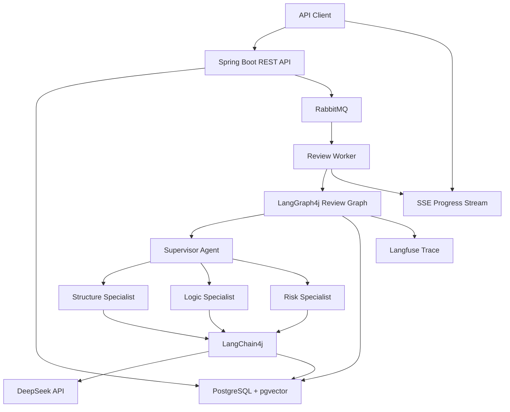
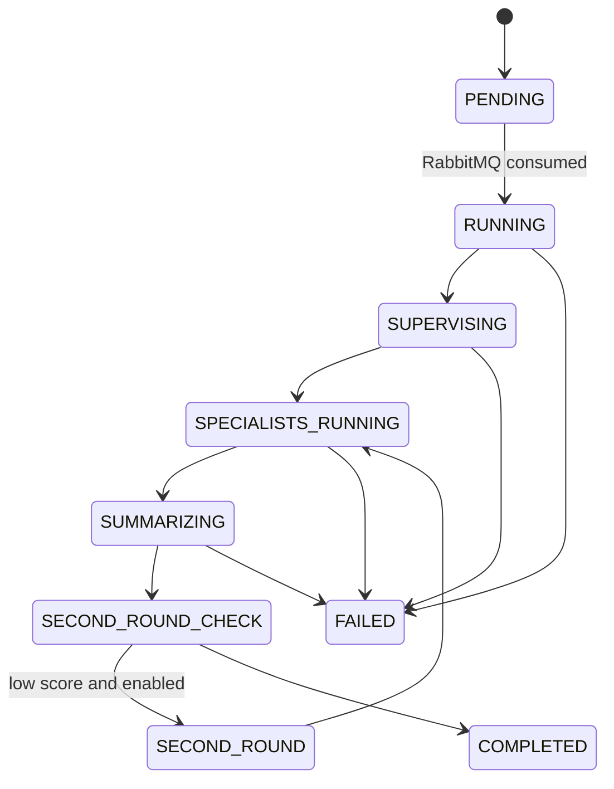

# CRITIQUEBOARD Design

Date: 2026-05-11

## Summary

CRITIQUEBOARD is a multi-agent review system. A user submits a document or proposal with review requirements. A Supervisor Agent analyzes the submission, assigns three Specialist Agents, collects their structured critiques, and produces a final review report with token cost accounting.

The first version is API-first. It focuses on the backend orchestration path rather than a full web UI.

## Goals

- Accept text input and review requirements through HTTP APIs.
- Run a real multi-agent review flow with DeepSeek API calls.
- Use LangGraph4j for state graph orchestration.
- Use LangChain4j for LLM calls, prompt templates, structured output, embeddings, and vector retrieval.
- Persist business data and vector data in PostgreSQL with pgvector.
- Process review jobs asynchronously through RabbitMQ.
- Push task progress through Server-Sent Events.
- Record Agent-level token usage and estimated cost.
- Keep prompt variants versioned for future A/B evaluation.

## Non-Goals For Version 1

- Full frontend application.
- User account and permission system.
- Complete A/B evaluation platform.
- Complex document upload parsing for PDF, DOCX, or PPTX.
- Multi-tenant deployment.
- Human-in-the-loop scoring workflow.

## Recommended Stack

- Java 21
- Spring Boot
- LangGraph4j
- LangChain4j
- DeepSeek API
- PostgreSQL with pgvector in Docker
- RabbitMQ in Docker
- Server-Sent Events
- Langfuse tracing
- Flyway or Liquibase for schema migration

MySQL is not part of the first-version main path. PostgreSQL is preferred because it can store both business tables and pgvector embeddings in one database.

## Architecture



## Component Responsibilities

### Spring Boot API

The API layer receives review requests, creates review tasks, exposes task status and reports, and provides an SSE endpoint for progress updates.

It should not contain Agent decision logic. It should validate input, persist the initial task, publish a queue message, and return the task id.

### RabbitMQ

RabbitMQ decouples user submission from review execution.

The initial queue can be simple:

- Exchange: `review.exchange`
- Queue: `review.task.queue`
- Routing key: `review.task.created`

The message payload should include only stable identifiers, such as `reviewTaskId`. Large text should be read from PostgreSQL by the worker.

### Review Worker

The worker consumes review task messages and runs the LangGraph4j state graph. It updates task status, writes review events, and sends progress messages to the SSE layer.

### LangGraph4j

LangGraph4j owns the review state machine:

- Initialize review context.
- Run Supervisor analysis.
- Fan out to three Specialist nodes.
- Join Specialist results.
- Summarize final report.
- Optionally trigger a second review round.
- Mark the task as completed or failed.

### LangChain4j

LangChain4j owns model-facing capabilities:

- DeepSeek chat model integration.
- Prompt templates.
- Structured Agent outputs.
- Embedding generation.
- pgvector retrieval.

This keeps graph orchestration separate from LLM and retrieval details.

### PostgreSQL + pgvector

PostgreSQL stores review tasks, document chunks, Agent runs, critique results, final reports, token usage, events, and prompt variants.

pgvector stores embeddings for document chunks. Specialist Agents use vector retrieval to ground feedback in source evidence.

### Langfuse

Langfuse should trace each review task and each Agent run. The trace id should be attached to the review task or Agent run when available.

## Review Flow

1. Client calls `POST /api/reviews` with text and review requirements.
2. API creates a `review_task` with status `PENDING`.
3. API splits the submitted text into chunks.
4. API or worker generates embeddings and writes `document_chunk` records.
5. API publishes a RabbitMQ message.
6. Worker consumes the message and marks the task as `RUNNING`.
7. Supervisor analyzes content type and creates three Specialist assignments.
8. Structure, Logic, and Risk Specialists run in parallel.
9. Each Specialist retrieves relevant document chunks from pgvector.
10. Each Specialist calls DeepSeek through LangChain4j.
11. Each Specialist returns a structured `CritiqueResult`.
12. Supervisor summarizes results into a final review report.
13. If second-round review is enabled and quality is below threshold, the graph runs another Specialist round.
14. Worker saves final report, token usage, and events.
15. Task status becomes `COMPLETED` or `FAILED`.

## State Flow



## Agent Roles

### Supervisor Agent

Responsibilities:

- Detect content type.
- Decide whether the text is reviewable.
- Create Specialist instructions.
- Merge Specialist results.
- Decide whether a second round is needed.
- Produce final report.

### Structure Specialist

Focus:

- Document organization.
- Section hierarchy.
- Missing context or misplaced sections.
- Flow between introduction, body, and conclusion.

### Logic Specialist

Focus:

- Claims and evidence.
- Reasoning gaps.
- Contradictions.
- Unclear assumptions.
- Weak conclusions.

### Risk Specialist

Focus:

- Execution risks.
- Compliance or safety risks.
- Ambiguous commitments.
- Hidden dependencies.
- Operational failure modes.

## Structured Agent Contract

Specialist Agents must return structured data compatible with:

```json
{
  "role": "STRUCTURE",
  "score": 82,
  "feedback": "The document has a clear top-level structure, but the success metrics section appears too late.",
  "evidence": [
    {
      "chunkId": "uuid",
      "quote": "Success metrics will be discussed after deployment.",
      "reason": "This affects reader understanding of project goals."
    }
  ],
  "suggestions": [
    "Move success metrics closer to the problem statement.",
    "Add a short summary before implementation details."
  ],
  "confidence": 0.86
}
```

The Java DTO should be named `CritiqueResult` and include at least:

- `role`
- `score`
- `feedback`
- `evidence`
- `suggestions`
- `confidence`

## Vector Retrieval Design

The first version uses pgvector for document-grounded review.

Document ingestion:

- Split submitted text into chunks by paragraph and token budget.
- Store each chunk in `document_chunk`.
- Generate embeddings through LangChain4j.
- Store embeddings in `document_chunk.embedding`.

Specialist retrieval:

- Each Specialist builds a role-specific retrieval query.
- The query is embedded.
- PostgreSQL returns the top matching chunks.
- Retrieved chunks are included in the Specialist prompt as evidence candidates.

Example retrieval intent:

- Structure Specialist: headings, transitions, missing sections.
- Logic Specialist: claims, reasons, conclusions, contradictions.
- Risk Specialist: constraints, dependencies, commitments, uncertain language.

## Database Model

The database schema is kept in a separate SQL file:

`db/001_init_critiqueboard_pgvector.sql`

Core tables:

- `review_task`
- `document_chunk`
- `agent_run`
- `critique_result`
- `critique_evidence`
- `review_report`
- `token_usage`
- `review_event`
- `prompt_variant`

The schema uses PostgreSQL enums, UUID primary keys, foreign keys, JSONB fields for flexible Agent payloads, and pgvector indexing for similarity search.

## API Design

### Create Review

`POST /api/reviews`

Request:

```json
{
  "title": "Product Launch Plan Review",
  "text": "Document content...",
  "requirement": "Focus on structure, logic, and execution risk.",
  "secondRoundEnabled": true
}
```

Response:

```json
{
  "reviewTaskId": "uuid",
  "status": "PENDING"
}
```

### Get Review

`GET /api/reviews/{id}`

Returns task status, final report if available, Agent result summaries, and token usage totals.

### Get Report

`GET /api/reviews/{id}/report`

Returns the final Markdown report.

### Get Agent Runs

`GET /api/reviews/{id}/agents`

Returns Supervisor and Specialist intermediate results.

### Subscribe To Events

`GET /api/reviews/{id}/events`

SSE event examples:

- `TASK_CREATED`
- `TASK_STARTED`
- `SUPERVISOR_STARTED`
- `SPECIALIST_STARTED`
- `SPECIALIST_COMPLETED`
- `SUMMARY_STARTED`
- `TASK_COMPLETED`
- `TASK_FAILED`

## Token Usage And Cost

Each Agent run should write one or more `token_usage` records.

Required fields:

- model name
- prompt tokens
- completion tokens
- total tokens
- estimated cost

If the model provider does not return token usage in a stable format, the system should estimate usage and mark the estimate in code-level metadata later. Version 1 can store only the numeric estimate.

## Prompt Variant Strategy

The first version includes `prompt_variant` for prompt versioning.

It is enough to support:

- active prompt per role
- prompt version
- prompt template body

Future A/B evaluation can add:

- `evaluation_dataset`
- `evaluation_case`
- `evaluation_run`
- `evaluation_result`
- `human_score`

## Error Handling

Expected failure cases:

- DeepSeek API timeout.
- Invalid structured output.
- Embedding generation failure.
- RabbitMQ redelivery.
- Database write failure.
- SSE client disconnect.

Rules:

- A failed Specialist should write a failed `agent_run`.
- The task should fail only when the graph cannot produce a usable final report.
- API timeouts should not cancel background review tasks.
- SSE disconnects should not affect task execution.
- Retry policy should be conservative for LLM calls to avoid unexpected cost spikes.

## Testing Strategy

Unit tests:

- DTO validation.
- chunking behavior.
- cost calculation.
- prompt selection.
- state transition helpers.

Integration tests:

- PostgreSQL schema and repositories.
- pgvector similarity query.
- RabbitMQ message publish and consume.
- Review task lifecycle with mocked model responses.

End-to-end smoke test:

- Submit a sample document.
- Observe SSE progress.
- Verify three Specialist results.
- Verify final report.
- Verify token usage totals.

## First Milestone

The first implementation milestone should deliver:

- Spring Boot project skeleton.
- Docker Compose for PostgreSQL with pgvector and RabbitMQ.
- SQL migration file.
- Review creation API.
- RabbitMQ task publishing and consuming.
- LangGraph4j review graph skeleton.
- LangChain4j DeepSeek adapter configuration.
- Three Specialist nodes with structured output.
- Final report generation.
- SSE progress endpoint.
- Token usage persistence.

## Open Decisions

- Exact DeepSeek model name.
- Embedding model provider and vector dimension.
- Whether embeddings are generated during API submission or worker execution.
- Whether Langfuse is mandatory in local development or optional by profile.
- Score threshold for second-round review.
- Whether final report is stored only as Markdown or also as structured JSON.
